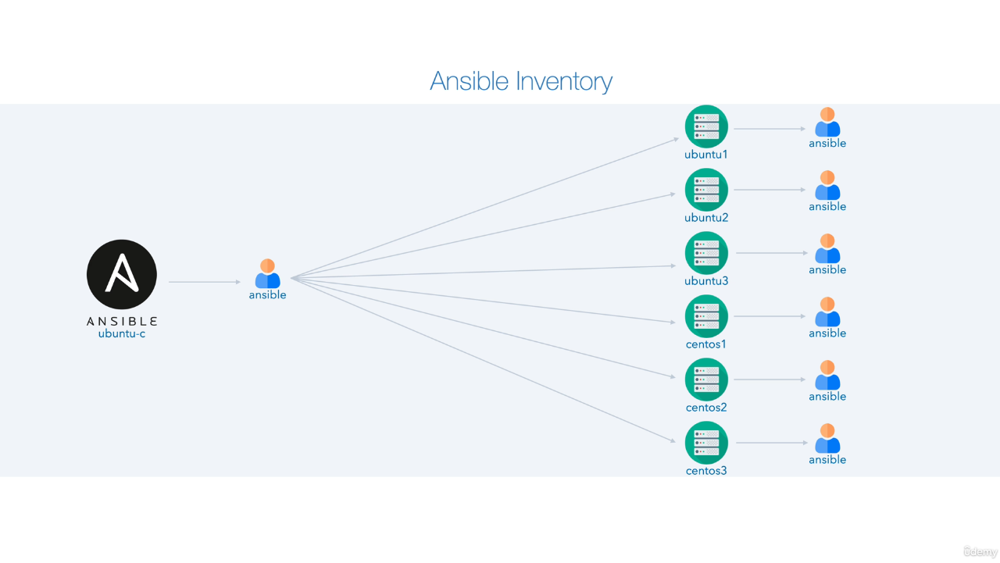
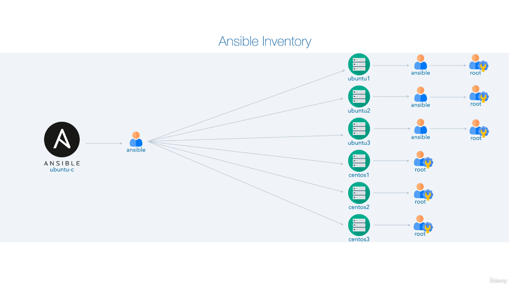
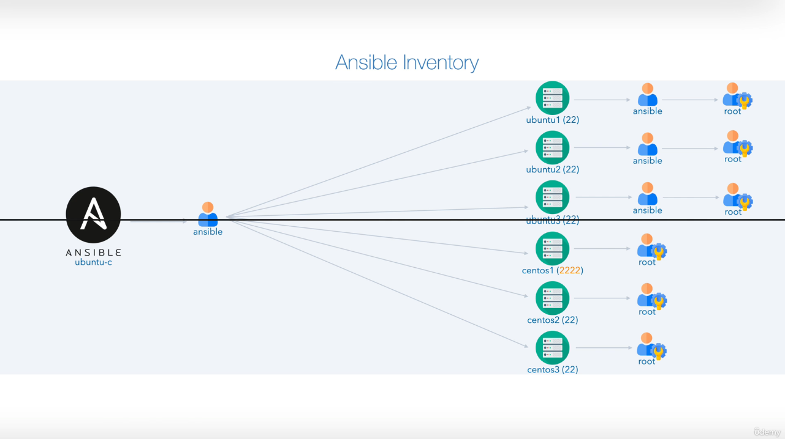

#### **Introduction to Ansible Inventories**

Welcome to the video on **Ansible Inventories**. In this session, we’ll cover:

1. **Understanding Ansible inventories**:
   - What they are and how they are used.
   - The types of inventories available.
   
2. **Managing connectivity**:
   - Providing root connectivity to CentOS hosts.
   - Using `sudo` for Ubuntu hosts.

3. **Variables in inventories**:
   - Host variables (host vars).
   - Group variables (group vars).

4. **Improving inventory structure**:
   - Simplifying entries with host ranges.
   - Using children groups for hierarchical organization.

5. **Real-world applications**:
   - Handling non-standard SSH ports.
   - Writing inventories in alternate formats like YAML and JSON.
   - Overriding variables with command-line options.

---

### **Recap of the Previous Video**
In the last video, we learned about **Ansible Configuration**:
- The role of `ansible.cfg` and its precedence.
- Configuring the course repository.

Now, we’ll dive into inventories, building on the foundational concepts.

---

### **Ansible Inventory Basics**

#### **Definition**
An **inventory** is a file listing the hosts (nodes) Ansible can manage. It organizes systems into groups and defines variables to manage them effectively.

#### **Types of Inventories**
1. **Static Inventory**:
   - Fixed list of hosts defined in a file (INI, YAML, or JSON formats).
   
2. **Dynamic Inventory**:
   - Generated dynamically using scripts or plugins, often integrating with cloud providers.

---

### **Course Repository Structure**

#### **Revisions and Hands-On Approaches**
The course repository offers:
1. **Ready-to-Use Revisions**:
   - Pre-configured examples (`01`, `02`, `03`, etc.).
   - Ideal for quick progress or reference.
   
2. **Hands-On Template**:
   - Skeleton files for creating configurations from scratch.
   - Encourages learning by doing but is more error-prone.

Each directory is self-contained, allowing incremental learning.

#### **Starting the Lab**
Navigate to the `inventories` folder:
```bash
cd Dive_Into_Ansible/Ansible_Architecture_and_Design/inventories/01
```
---
### **Every inventories has its own config file:**
```bash
ansible@ubuntu-c:~/diveintoansible/Ansible Architecture and Design/Inventories/02$ cat ansible.cfg 
[defaults]
inventory = hosts
host_key_checking = False

ansible@ubuntu-c:~/diveintoansible/Ansible Architecture and Design/Inventories/02$ ansible --version
ansible [core 2.17.4]
  config file = /home/ansible/diveintoansible/Ansible Architecture and Design/Inventories/02/ansible.cfg
  configured module search path = ['/home/ansible/.ansible/plugins/modules', '/usr/share/ansible/plugins/modules']
  ansible python module location = /usr/local/lib/python3.10/dist-packages/ansible
  ansible collection location = /home/ansible/.ansible/collections:/usr/share/ansible/collections
  executable location = /usr/local/bin/ansible
  python version = 3.10.12 (main, Nov  6 2024, 20:22:13) [GCC 11.4.0] (/usr/bin/python3)
  jinja version = 3.1.4
  libyaml = True
```

### Inventory = hosts
```bash
ansible@ubuntu-c:~/diveintoansible/Ansible Architecture and Design/Inventories/03$ cat hosts
[centos]
centos1
centos2
centos3

[ubuntu]
ubuntu1
ubuntu2
ubuntu3

ansible@ubuntu-c:~/diveintoansible/Ansible Architecture and Design/Inventories/03$ ansible centos --list-hosts
  hosts (3):
    centos1
    centos2
    centos3

ansible@ubuntu-c:~/diveintoansible/Ansible Architecture and Design/Inventories/03$ ansible ubuntu --list-hosts
  hosts (3):
    ubuntu1
    ubuntu2
    ubuntu3

ansible@ubuntu-c:~/diveintoansible/Ansible Architecture and Design/Inventories/03$ ansible ~.*3 --list-hosts
  hosts (2):
    centos3
    ubuntu3    
```
---

### **Testing Connectivity**
Verify connectivity to a CentOS host:
```bash
ansible '*' -m ping
ansible@ubuntu-c:~/diveintoansible/Ansible Architecture and Design/Inventories/03$ ansible all -m ping -o
ubuntu1 | SUCCESS => {"ansible_facts": {"discovered_interpreter_python": "/usr/bin/python3.10"},"changed": false,"ping": "pong"}
ubuntu2 | SUCCESS => {"ansible_facts": {"discovered_interpreter_python": "/usr/bin/python3.10"},"changed": false,"ping": "pong"}
centos2 | SUCCESS => {"ansible_facts": {"discovered_interpreter_python": "/usr/bin/python3.9"},"changed": false,"ping": "pong"}
centos3 | SUCCESS => {"ansible_facts": {"discovered_interpreter_python": "/usr/bin/python3.9"},"changed": false,"ping": "pong"}
centos1 | SUCCESS => {"ansible_facts": {"discovered_interpreter_python": "/usr/bin/python3.9"},"changed": false,"ping": "pong"}
ubuntu3 | SUCCESS => {"ansible_facts": {"discovered_interpreter_python": "/usr/bin/python3.10"},"changed": false,"ping": "pong"}
```
```bash
ansible -i hosts all -m ping
```
- The `hosts` file specifies the inventory.
- The `ping` module checks connectivity.

---

### **Understanding Inventory Files**

#### **Default Inventory**
The default inventory file (`hosts`) is referenced in `ansible.cfg`:
```ini
[defaults]
inventory = hosts
```

#### **INI Format**
An INI-style inventory groups hosts:
```ini
[all]
centos1
```
- All hosts belong to the implicit `all` group.
- Groups can be explicitly named (e.g., `[centos]`).

---

### **Configuring SSH Connectivity**

#### **Host Key Checking**
Ansible uses SSH to connect to hosts. By default, it validates host keys, requiring manual confirmation on the first connection.

##### **Temporary Override**
Use the environment variable for a single command:
```bash
ANSIBLE_HOST_KEY_CHECKING=False ansible all -m ping
```

##### **Permanent Configuration**
Add the following to `ansible.cfg`:
```ini
[defaults]
host_key_checking = False
```

---

### **Groups and Variables**

#### **Grouping Hosts**
Organize hosts into groups:
```ini
[centos]
centos1
centos2
```

#### **Host Variables**
Define specific variables for a host:
```ini
ansible@ubuntu-c:~/diveintoansible/Ansible Architecture and Design/Inventories/05$ cat hosts 
[centos]
centos1 ansible_user=root
centos2 ansible_user=root
centos3 ansible_user=root

[ubuntu]
ubuntu1 ansible_become=true ansible_become_pass=password
ubuntu2 ansible_become=true ansible_become_pass=password
ubuntu3 ansible_become=true ansible_become_pass=password
```

#### **Group Variables**
Apply variables to all hosts in a group:
```ini
[centos:vars]
ansible_user=root
```

#### **Children Groups**
Group multiple groups under a parent:
```ini
[linux:children]
centos
ubuntu
```

---

### **Improving Inventory with Ranges**
Use ranges to simplify repetitive entries:
```ini
[centos]
centos[1:3]
```
This expands to `centos1`, `centos2`, `centos3`.

---

### Update:
```bash
ansible@ubuntu-c:~$ ssh root@centos1 -p 22
root@centos1's password: 

[root@centos1 ~]# cd /utils

[root@centos1 utils]# ls
healthcheck.sh  update_sshd_ports.sh

[root@centos1 utils]# cat update_sshd_ports.sh 
```
```bash
#!/bin/bash

# Function to display help message
show_help() {
  echo -e "Usage: $0 [port1 port2 ...]"
  echo -e "Example: $0 22 2222"
  echo -e "Specify one or more ports to configure SSHD to listen on.\n"
}

# Check if the script is run as root
if [ "$(id -u)" -ne 0 ]; then
  echo -e "🚫 This script must be run as root"
  exit 1
fi

# Check if no arguments were provided
if [ $# -eq 0 ]; then
  show_help
  exit 1
fi

# Create a timestamped backup of the original sshd_config file
timestamp=$(date +"%Y%m%d%H%M%S")
cp /etc/ssh/sshd_config /etc/ssh/sshd_config.bak_$timestamp
echo -e "🔒 Backup of sshd_config created at /etc/ssh/sshd_config.bak_$timestamp"

# Remove existing 'Port' entries from the config file
sed -i '/^Port /d' /etc/ssh/sshd_config
echo -e "🧹 Existing Port entries removed."

# Add new port entries from the script arguments
for port in "$@"; do
  echo "Port $port" >> /etc/ssh/sshd_config
done
echo -e "🔧 New Port entries added for: $*"

# Restart the SSHD service to apply changes
if systemctl restart sshd.service; then
  echo -e "✅ SSHD has been successfully restarted and is now listening on ports: $*"
else
  echo -e "❌ Failed to restart SSHD. Check your configuration."
fi
```
```bash
[root@centos1 utils]# ./update_sshd_ports.sh 2222
🔒 Backup of sshd_config created at /etc/ssh/sshd_config.bak_20250113090430
🧹 Existing Port entries removed.
🔧 New Port entries added for: 2222
✅ SSHD has been successfully restarted and is now listening on ports: 2222
[root@centos1 utils]# exit
logout
Connection to centos1 closed.
```

##### to listen on both port 22 and 2222 
```bash
ssh root@centos1 -p 2222
root@centos1's password: 
Last login: Mon Jan 13 09:01:54 2025 from 172.22.0.6
[root@centos1 ~]# /utils/update_sshd_ports.sh 22 2222
🔒 Backup of sshd_config created at /etc/ssh/sshd_config.bak_20250113092043
🧹 Existing Port entries removed.
🔧 New Port entries added for: 22 2222
✅ SSHD has been successfully restarted and is now listening on ports: 22 2222
[root@centos1 ~]# exit
logout
Connection to centos1 closed.
```

### **Handling Non-Standard SSH Ports**
Hosts running SSH on non-default ports require configuration:
1. Specify the port in the inventory:
   ```ini
   centos1 ansible_port=2222
   ```
2. Alternatively, use the `:` notation:
   ```ini
   centos1:2222
   ```

---

### **Alternate Inventory Formats**

#### **YAML Format**
Equivalent to the INI example:
```yaml
centos:
  hosts:
    centos1:
      ansible_user: root
```
- YAML uses hierarchical structures.
- Begin and end with `---` and `...` for clarity (optional).

#### **JSON Format**
Convert YAML to JSON using Python:
```bash
python -c 'import sys, yaml, json; json.dump(yaml.safe_load(sys.stdin), sys.stdout, indent=4)' < hosts.yml > hosts.json
```

---

### **Overriding Variables**
Override inventory variables with the `-e` flag:
```bash
ansible -i hosts all -e ansible_port=22 -m ping
```
- Overrides `ansible_port` for all hosts during the command.

---

### **Key Takeaways**
1. Inventories define the hosts and their configurations.
2. Group and host variables simplify management.
3. Alternate formats (YAML/JSON) are supported.
4. Overrides and dynamic adjustments are possible.

---

### **Next Steps**
In the next video, we’ll explore **Ansible Modules**:
- Common modules and their uses.
- Using the `ansible` command-line tool for module execution.

Join me as we dive deeper into Ansible!