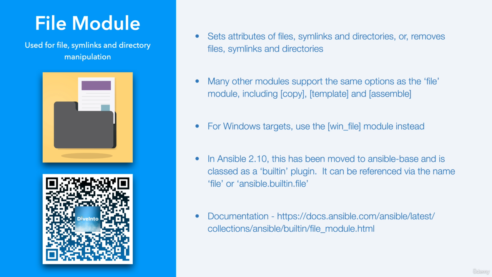
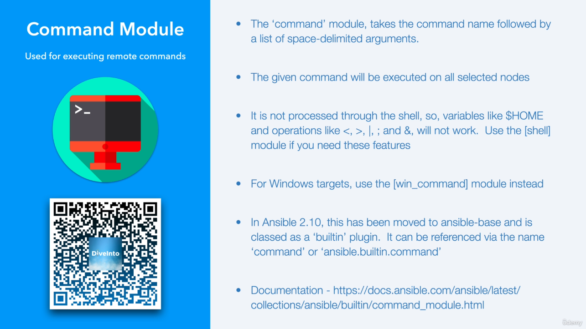

Here’s an enhanced and detailed version of the transcript, enriched with examples, explanations, and additional context where relevant:

---

## **Ansible Modules Overview**

Hello and welcome to this video on **Ansible Modules**.  
Ansible is a **batteries-included framework** that comes with a wide array of modules designed to simplify various tasks across system management, application deployment, and orchestration.

### **Key Topics Covered**:
1. **Setup Module**: Collecting system information or "facts."
2. **File Module**: Managing files and directories.
3. **Color Notations and Idempotence**: Ansible's execution feedback mechanism.
4. **Copy Module**: Transferring files between systems.
5. **Command Module**: Running commands on remote systems.
6. **Ansible-Doc Tool**: Accessing module documentation directly from the CLI.

Let’s dive in!

---

## **1. Setup Module**

The **setup module** is used to gather system information, known as **facts**, about remote hosts. This information includes IP addresses, OS details, CPU architecture, and more. By default, this module is called automatically when running playbooks, but you can invoke it directly using the `ansible` CLI.

### **Command Example**:
```bash
ansible centos1 -m setup
```

This command gathers facts about the `centos1` host and outputs the data. To make the output readable:
```bash
ansible centos1 -m setup | more
```

### **What Are Facts?**
Facts are key-value pairs containing detailed system information. Examples include:
- `ansible_distribution`: The name of the operating system (e.g., Ubuntu, CentOS).
- `ansible_processor_cores`: Number of processor cores.
- `ansible_all_ipv4_addresses`: All IPv4 addresses assigned to the system.

### **Ansible Collections**:
With Ansible 2.10, modules were reorganized into **collections**. For example:
- The **setup module** resides in the `ansible.builtin` collection.  
  - Short name: `setup`
  - Fully qualified name: `ansible.builtin.setup`

You can use either, but the fully qualified name is preferred for clarity in complex playbooks.

---

## **2. File Module**

The **file module** manages file and directory attributes, such as permissions, ownership, and symbolic links.

### **Creating a File**:
To create a file equivalent to the Unix `touch` command:
```bash
ansible all -m file -a "path=/tmp/test state=touch"
```

This command creates `/tmp/test` on all hosts, updating the timestamp if the file already exists. The output will be **yellow**, indicating a change.

```bash
ls -altrh /tmp/test
-rw-rw-r-- 1 ansible ansible 0 Jan 13 12:57 /tmp/test
ssh centos2 ls -althr /tmp/test
-rw-r--r-- 1 ansible ansible 0 Jan 13 12:57 /tmp/test
```

### **Setting Permissions**:
To set permissions, use the `mode` parameter:
```bash
$ ansible all -m file -a "path=/tmp/test mode=0600 state=file"

$ ls -altrh /tmp/test
-rw------- 1 ansible ansible 0 Jan 13 12:57 /tmp/test
$ ssh centos2 ls -althr /tmp/test
-rw------- 1 ansible ansible 0 Jan 13 12:57 /tmp/test
```

- `0600`: Read and write for the owner only (no permissions for group and others).
- Ansible ensures **idempotence**, so running the command again will yield a **green** output if no changes are needed.

```bash
$ chmod 644 /tmp/test
$ ansible all -m file -a 'path=/tmp/test state=file mode=600'
ubuntu-c | CHANGED => {
    "ansible_facts": {
        "discovered_interpreter_python": "/usr/bin/python3.10"
    },
    "changed": true,
    "gid": 1000,
    "group": "ansible",
    "mode": "0600",
    "owner": "ansible",
    "path": "/tmp/test",
    "size": 0,
    "state": "file",
    "uid": 1000
}
ubuntu1 | SUCCESS => {
    "ansible_facts": {
        "discovered_interpreter_python": "/usr/bin/python3.10"
    },
    "changed": false,
    "gid": 0,
    "group": "root",
    "mode": "0600",
    "owner": "root",
    "path": "/tmp/test",
    "size": 0,
    "state": "file",
    "uid": 0
}
```

### **Idempotence in Action**:
If the file is already in the desired state, Ansible skips unnecessary changes:
- **First Run**: File created/modified (**yellow**).
- **Subsequent Runs**: No changes needed (**green**).

---

## **3. Color Notations and Idempotence**

Ansible uses color-coded output to indicate the state of execution:
- **Green**: Success with no changes.
- **Yellow**: Success with changes made.
- **Red**: Failure.

### **What is Idempotence?**
Idempotence ensures that running the same command multiple times produces the same result without altering the system unnecessarily. This is crucial for maintaining predictable and reliable configurations.

---

## **4. Copy Module**

The **copy module** transfers files from the control node to remote systems.

### **Basic Usage**:
```bash
ansible all -m copy -a "src=/path/to/local/file dest=/path/to/remote/file"

$ ansible all -m copy -a 'src=/tmp/x dest=/tmp/x'
ubuntu-c | SUCCESS => {
    "ansible_facts": {
        "discovered_interpreter_python": "/usr/bin/python3.10"
    },
    "changed": false,
    "checksum": "da39a3ee5e6b4b0d3255bfef95601890afd80709",
    "dest": "/tmp/x",
    "gid": 1000,
    "group": "ansible",
    "mode": "0664",
    "owner": "ansible",
    "path": "/tmp/x",
    "size": 0,
    "state": "file",
    "uid": 1000
}
centos3 | CHANGED => {
    "ansible_facts": {
        "discovered_interpreter_python": "/usr/bin/python3.9"
    },
    "changed": true,
    "checksum": "da39a3ee5e6b4b0d3255bfef95601890afd80709",
    "dest": "/tmp/x",
    "gid": 1000,
    "group": "ansible",
    "md5sum": "d41d8cd98f00b204e9800998ecf8427e",
    "mode": "0644",
    "owner": "ansible",
    "size": 0,
    "src": "/home/ansible/.ansible/tmp/ansible-tmp-1736773829.8501327-5095-54291967446648/.source",
    "state": "file",
    "uid": 1000
}
```

### **Key Features**:
1. **Checksum Validation**: Ansible checks if the file has changed before copying, ensuring efficiency.
2. **Remote Source**: To copy files within the remote system itself, use:
   ```bash
   ansible all -m copy -a "src=/etc/hosts dest=/tmp/hosts_copy remote_src=yes"
   ```

---

## **5. Command Module**

The **command module** runs commands on remote hosts. It’s the default module, so you can omit `-m command`.

### **Example**:
```bash
$ ansible all -a 'hostname' -o
ubuntu-c | CHANGED | rc=0 | (stdout) ubuntu-c
centos3 | CHANGED | rc=0 | (stdout) centos3
centos2 | CHANGED | rc=0 | (stdout) centos2
centos1 | CHANGED | rc=0 | (stdout) centos1
ubuntu1 | CHANGED | rc=0 | (stdout) ubuntu1
ubuntu2 | CHANGED | rc=0 | (stdout) ubuntu2
ubuntu3 | CHANGED | rc=0 | (stdout) ubuntu3
```

### **Idempotence with Command Module**:
Use `creates` or `removes` to make commands idempotent:
- **Creates**: Skip the command if a specified file exists.
  ```bash
  ansible all -m command -a "cmd=touch /tmp/example creates=/tmp/example"

  $ ansible all -a 'touch /tmp/test_command_module creates=/tmp/test_command_module'
    ubuntu-c | CHANGED | rc=0 >>

    ubuntu1 | CHANGED | rc=0 >>

    ubuntu2 | CHANGED | rc=0 >>

    centos1 | CHANGED | rc=0 >>
  $ ansible all -a 'touch /tmp/test_command_module creates=/tmp/test_command_module'
    ubuntu-c | SUCCESS | rc=0 >>
    skipped, since /tmp/test_command_module existsDid not run command since '/tmp/test_command_module' exists
    centos3 | SUCCESS | rc=0 >>
    skipped, since /tmp/test_command_module existsDid not run command since '/tmp/test_command_module' exists
    centos2 | SUCCESS | rc=0 >>
    skipped, since /tmp/test_command_module existsDid not run command since '/tmp/test_command_module' exists  
  ```
- **Removes**: Run the command only if a specified file exists.
  ```bash
  ansible all -m command -a "cmd=rm /tmp/example removes=/tmp/example"

  $ ansible all -a 'rm /tmp/test_command_module removes=/tmp/test_command_module'
    ubuntu-c | CHANGED | rc=0 >>

    ubuntu1 | CHANGED | rc=0 >>
  $ ansible all -a 'rm /tmp/test_command_module removes=/tmp/test_command_module'
    ubuntu-c | SUCCESS | rc=0 >>
    skipped, since /tmp/test_command_module does not existDid not run command since '/tmp/test_command_module' does not exist    
  ```

---

## **6. Fetch Module**

The **fetch module** retrieves files from remote systems to the control node.

### **Exercise**:
1. Create a file on the remote host:
   ```bash
   $ ansible all -m file -a 'path=/tmp/test_modules.txt state=touch mode=600' -o

   $ ls -altrh /tmp/test_modules.txt
    -rw------- 1 ansible ansible 0 Jan 13 14:03 /tmp/test_modules.txt

   $ ssh centos2 ls -althr /tmp/test_modules.txt
    -rw------- 1 ansible ansible 0 Jan 13 14:03 /tmp/test_modules.txt
   ```
2. Fetch the file to the control node:
   ```bash
   $ ansible all -m fetch -a "src=/tmp/test_modules.txt dest=./test/ flat=yes" -o
    ubuntu-c | SUCCESS => {"changed": false,"checksum": "da39a3ee5e6b4b0d3255bfef95601890afd80709","dest": "/home/ansible/diveintoansible/Ansible Architecture and Design/Modules/test/test_modules.txt","file": "/tmp/test_modules.txt","md5sum": "d41d8cd98f00b204e9800998ecf8427e"}
    centos3 | SUCCESS => {"changed": false,"checksum": "da39a3ee5e6b4b0d3255bfef95601890afd80709","dest": "/home/ansible/diveintoansible/Ansible Architecture and Design/Modules/test/test_modules.txt","file": "/tmp/test_modules.txt","md5sum": "d41d8cd98f00b204e9800998ecf8427e"}
   ```

### **Output**:
The file will be stored locally in a directory structure based on the hostname.

---

## **7. Ansible-Doc**

The **ansible-doc** command provides detailed information about modules, including their parameters and examples.

### **Usage**:
To view documentation for the `file` module:
```bash
ansible-doc file
```

This displays:
- A description of the module.
- Available parameters (e.g., `path`, `state`, `mode`).
- Examples of usage.

For advanced users, the source code path is also provided, allowing in-depth exploration.

---

## **Conclusion**

In this video, we covered:
- The setup module and Ansible facts.
- Managing files with the file module.
- The importance of idempotence in Ansible operations.
- Using the copy and command modules.
- Exploring module documentation with ansible-doc.

### **Next Steps**:
Join us in the next section, where we’ll dive into **Ansible Playbooks**, a powerful way to automate and manage tasks efficiently.

--- 

This expanded transcript includes more examples, detailed explanations, and exercises to reinforce learning. Let me know if you'd like additional enhancements or clarifications!