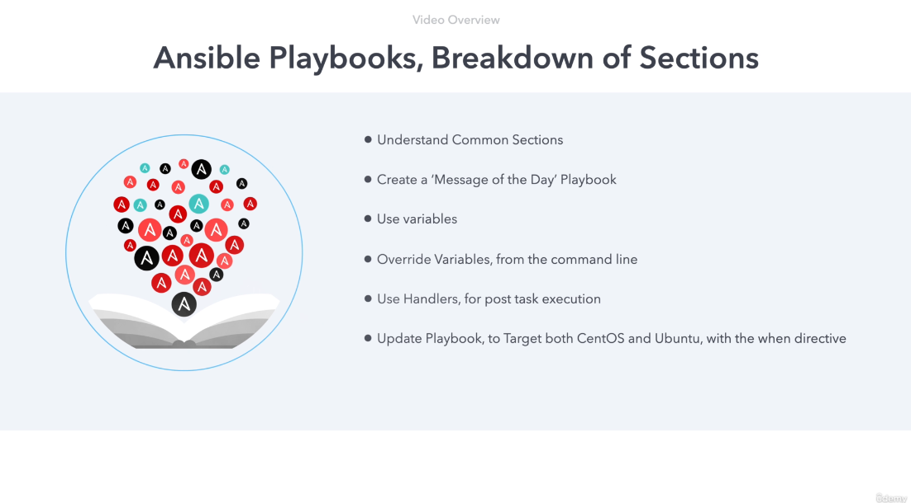

# Ansible Playbooks: Breakdown of Sections

Welcome to this video! 

In this session, we will dive into **Ansible Playbooks**, breaking them down into key sections and understanding how to utilize them effectively. We'll also walk through the creation of an example playbook to update the **Message of the Day (MOTD)** on CentOS hosts. Here's a breakdown of what we’ll cover:

1. **Common Playbook Sections** - A structured overview.
2. **Variables** - How to define, use, and manipulate them, including command-line overrides.
3. **Handlers** - Their role in post-task execution.
4. **Dynamic Targeting** - Leveraging system facts to target different distributions (e.g., CentOS and Ubuntu) using the `when` directive.
5. **Real-world Example** - Step-by-step execution of tasks, roles, and handlers.

---

## Understanding Playbooks

### YAML Overview

Ansible Playbooks are written in **YAML**, a human-readable data format. YAML is structured with:
- **Lists**: Represented with dashes (`-`).
- **Key-Value Pairs**: Defined using colons (`:`).

### Playbook Structure

A playbook can consist of one or more **plays**. Each play targets a group of hosts and defines tasks to be executed.

Here’s an annotated skeleton of a playbook:

```yaml
- name: Update Message of the Day
  hosts: centos  # Target group
  become: yes    # Gain root privileges
  tasks:         # Task section
    - name: Copy MOTD file
      copy: 
        src: centos_motd
        dest: /etc/motd
  handlers:      # Handlers section
    - name: Restart Service
      service:
        name: my_service
        state: restarted
```
```bash
ansible@ubuntu-c:~/diveintoansible/Ansible Playbooks, Introduction/Ansible Playbooks, Breakdown of Sections/02$ cat motd_playbook.yaml 
```
```yaml
---
# YAML documents begin with the document separator ---

# The minus in YAML this indicates a list item.  The playbook contains a list 
# of plays, with each play being a dictionary
-
 
  # Hosts: where our play will run and options it will run with
  hosts: centos
  user: root

  # Vars: variables that will apply to the play, on all target systems

  # Tasks: the list of tasks that will be executed within the playbook
  tasks:
    - name: Configure a MOTD (message of the day)
      copy:
        src: centos_motd
        dest: /etc/motd

  # Handlers: the list of handlers that are executed as a notify key from a task

  # Roles: list of roles to be imported into the play

# Three dots indicate the end of a YAML document
...
```
```bash
ansible@ubuntu-c:~/diveintoansible/Ansible Playbooks, Introduction/Ansible Playbooks, Breakdown of Sections/02$ ansible-playbook motd_playbook.yaml 

PLAY [centos] ***********************************************************************************************************************************************************************************************************************************

TASK [Gathering Facts] **************************************************************************************************************************************************************************************************************************
ok: [centos1]
ok: [centos3]
ok: [centos2]

TASK [Configure a MOTD (message of the day)] ****************************************************************************************************************************************************************************************************
changed: [centos1]
changed: [centos2]
changed: [centos3]

PLAY RECAP **************************************************************************************************************************************************************************************************************************************
centos1                    : ok=2    changed=1    unreachable=0    failed=0    skipped=0    rescued=0    ignored=0   
centos2                    : ok=2    changed=1    unreachable=0    failed=0    skipped=0    rescued=0    ignored=0   
centos3                    : ok=2    changed=1    unreachable=0    failed=0    skipped=0    rescued=0    ignored=0   

ansible@ubuntu-c:~/diveintoansible/Ansible Playbooks, Introduction/Ansible Playbooks, Breakdown of Sections/02$ ansible-playbook motd_playbook.yaml 

PLAY [centos] ***********************************************************************************************************************************************************************************************************************************

TASK [Gathering Facts] **************************************************************************************************************************************************************************************************************************
ok: [centos1]
ok: [centos2]
ok: [centos3]

TASK [Configure a MOTD (message of the day)] ****************************************************************************************************************************************************************************************************
ok: [centos3]
ok: [centos2]
ok: [centos1]

PLAY RECAP **************************************************************************************************************************************************************************************************************************************
centos1                    : ok=2    changed=0    unreachable=0    failed=0    skipped=0    rescued=0    ignored=0   
centos2                    : ok=2    changed=0    unreachable=0    failed=0    skipped=0    rescued=0    ignored=0   
centos3                    : ok=2    changed=0    unreachable=0    failed=0    skipped=0    rescued=0    ignored=0   

```

---

### Revision 01: Playbook Skeleton

In this revision:
- The **`hosts`** directive specifies the target (e.g., `centos`).
- The **`tasks`** section defines actions, such as copying a file.
- **`handlers`** are triggered only when a task indicates a change.

This basic structure forms the foundation of every playbook.

---

## Real-world Example: Updating the MOTD on CentOS Hosts

### Revision 02: Initial Playbook Execution

#### Inventory File
The inventory defines your hosts:
```ini
[centos]
centos1 ansible_host=192.168.1.10 ansible_user=root
```

#### Playbook
```yaml
- name: Update MOTD on CentOS
  hosts: centos
  become: yes
  tasks:
    - name: Copy MOTD
      copy:
        src: centos_motd
        dest: /etc/motd
```

#### Execution
Run the playbook with:
```bash
ansible-playbook update_motd.yml
```

Output:
- Yellow indicates tasks were successfully executed with changes.
- Green indicates no changes were needed.

---

### Revision 03: Optimizing Execution Time

- **Default Behavior**: Ansible gathers facts using the `setup` module before running tasks. While useful, this adds overhead.
- **Optimization**: Disable fact gathering with `gather_facts: false`.

#### Before Optimization
```bash
time ansible-playbook update_motd.yml
# Execution Time: ~5.795 seconds
```

#### After Optimization
```yaml
- name: Update MOTD without facts
  hosts: centos
  gather_facts: false
  tasks:
    - name: Copy MOTD
      copy:
        src: centos_motd
        dest: /etc/motd
```
```bash
time ansible-playbook update_motd.yml
# Execution Time: ~4.212 seconds
```

---

### Revision 04: Using `content` Instead of `src`

#### Updated Playbook
```yaml
tasks:
  - name: Set MOTD content directly
    copy:
      content: "Welcome to CentOS\n"
      dest: /etc/motd
```

- Ansible treats even minor changes (e.g., newline differences) as modifications.
- To handle such cases, ensure the file content matches precisely, including newlines.

---

### Revision 05: Introducing Variables

#### Playbook with Variables
```yaml
vars:
  motd_message: "Welcome to CentOS\n"
tasks:
  - name: Set MOTD using variable
    copy:
      content: "{{ motd_message }}"
      dest: /etc/motd
```

- Use variables for maintainability and flexibility.
- Override variables dynamically with `--extra-vars`:
  ```bash
  ansible-playbook update_motd.yml -e "motd_message='Hello, World!'"
  ```

---

### Revision 06: Adding Handlers

#### Example
```yaml
handlers:
  - name: Notify MOTD change
    debug:
      msg: "MOTD has been updated!"
tasks:
  - name: Copy MOTD
    copy:
      content: "{{ motd_message }}"
      dest: /etc/motd
    notify: Notify MOTD change
```

- Handlers execute **only once** at the end of the play if a task triggers them.

---

### Revision 07: Targeting Multiple Distributions

#### Dynamic Targeting with Facts
Use the `when` directive to conditionally execute tasks:
```yaml
tasks:
  - name: Set MOTD for CentOS
    copy:
      content: "Welcome to CentOS\n"
      dest: /etc/motd
    when: ansible_distribution == "CentOS"

  - name: Set MOTD for Ubuntu
    copy:
      content: "Welcome to Ubuntu\n"
      dest: /etc/motd
    when: ansible_distribution == "Ubuntu"
```

---

## Challenge: Dynamic MOTD for Ubuntu

1. **Directory Setup**:
   - Copy `ansible.cfg` and inventory file.
   - Ensure hosts are reachable with `ansible -m ping`.

2. **Playbook Creation**:
   - Target `ubuntu` group.
   - Add tasks to copy the file `/etc/update-motd.d/60-ansible-motd` with mode preserved.

3. **Handler Addition**:
   - Notify a debug handler on file change.

4. **Execution**:
   ```bash
   ansible-playbook ubuntu_motd.yml
   ```

5. **Solution**:
    ```bash
    ansible@ubuntu-c:~/diveintoansible/Ansible Playbooks, Introduction/Ansible Playbooks, Breakdown of Sections/challenge$ cat motd_playbook.yaml 
    ---
    # YAML documents begin with the document separator ---

    # The minus in YAML this indicates a list item.  The playbook contains a list 
    # of plays, with each play being a dictionary
    -

      # Hosts: where our play will run and options it will run with
      hosts: ubuntu
      user: root

      # Vars: variables that will apply to the play, on all target systems

      # Tasks: the list of tasks that will be executed within the play, this section
      #       can also be used for pre and post tasks
      tasks:
        - name: Create a Copy of 60-ansible-motd
          copy:
            src: 60-ansible-motd
            dest: /etc/update-motd.d/60-ansible-motd
            mode: preserve
          notify: Debug, if there is a change

      # Handlers: the list of handlers that are executed as a notify key from a task
      handlers:
        - name: Debug, if there is a change
          debug:
            msg: Change occurred

      # Roles: list of roles to be imported into the play

    # Three dots indicate the end of a YAML document
    ...
    ```
    ```bash
    ansible@ubuntu-c:~/diveintoansible/Ansible Playbooks, Introduction/Ansible Playbooks, Breakdown of Sections/challenge$ ansible-playbook motd_playbook.yaml 

    PLAY [ubuntu] ***********************************************************************************************************************************************************************************************************************************

    TASK [Gathering Facts] **************************************************************************************************************************************************************************************************************************
    ok: [ubuntu3]
    ok: [ubuntu1]
    ok: [ubuntu2]

    TASK [Create a Copy of 60-ansible-motd] *********************************************************************************************************************************************************************************************************
    changed: [ubuntu2]
    changed: [ubuntu1]
    changed: [ubuntu3]

    RUNNING HANDLER [Debug, if there is a change] ***************************************************************************************************************************************************************************************************
    ok: [ubuntu1] => {
        "msg": "Change occurred"
    }
    ok: [ubuntu2] => {
        "msg": "Change occurred"
    }
    ok: [ubuntu3] => {
        "msg": "Change occurred"
    }

    PLAY RECAP **************************************************************************************************************************************************************************************************************************************
    ubuntu1                    : ok=3    changed=1    unreachable=0    failed=0    skipped=0    rescued=0    ignored=0   
    ubuntu2                    : ok=3    changed=1    unreachable=0    failed=0    skipped=0    rescued=0    ignored=0   
    ubuntu3                    : ok=3    changed=1    unreachable=0    failed=0    skipped=0    rescued=0    ignored=0   

    ```
---

### Cleanup
To remove the file:
```bash
$ ansible ubuntu -m file -a 'path=/etc/update-motd.d/60-ansible-motd state=absent' -o
ubuntu3 | CHANGED => {"ansible_facts": {"discovered_interpreter_python": "/usr/bin/python3.10"},"changed": true,"path": "/etc/update-motd.d/60-ansible-motd","state": "absent"}
ubuntu2 | CHANGED => {"ansible_facts": {"discovered_interpreter_python": "/usr/bin/python3.10"},"changed": true,"path": "/etc/update-motd.d/60-ansible-motd","state": "absent"}
ubuntu1 | CHANGED => {"ansible_facts": {"discovered_interpreter_python": "/usr/bin/python3.10"},"changed": true,"path": "/etc/update-motd.d/60-ansible-motd","state": "absent"}
```

---

### Additional Resources

- [Ansible Module Documentation](https://docs.ansible.com/ansible/latest/collections/ansible/builtin/)
- [Ansible Playbook Keywords](https://docs.ansible.com/ansible/latest/reference_appendices/playbooks_keywords.html)

Join me in the next video, where we’ll explore **Ansible Variables** in greater depth.