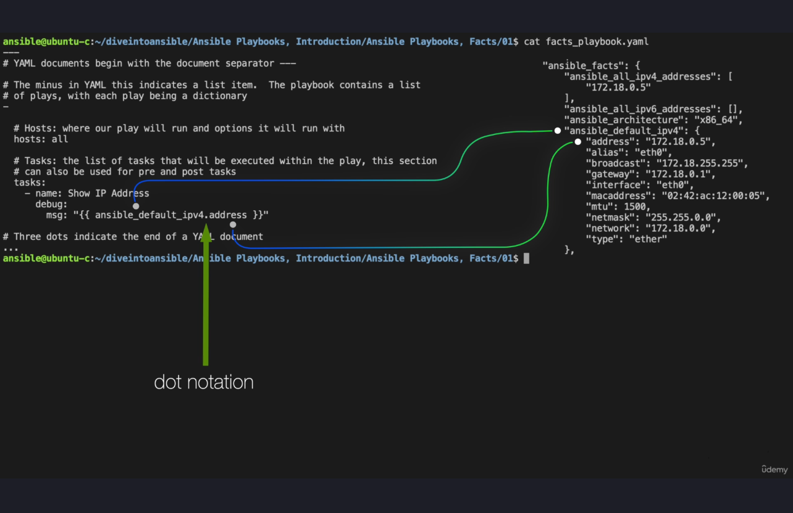

Here’s a detailed and enhanced version of the transcript, including added examples, updated information, and more structured explanations:

---

### Enhanced Transcript: Ansible Playbooks – Facts

#### Overview
In this video, we’ll dive into the use of **Ansible facts** and how they are managed, customized, and leveraged in playbooks. Facts are crucial for making informed decisions during playbook execution and automating tasks based on target-specific conditions.

#### **Ansible Setup Module**
The `setup` module:
- Automatically runs by default at the start of every playbook execution.
- Collects system-level information (facts) about the target host, such as network details, OS information, and hardware specifications.
- These facts are stored as variables in the `ansible_facts` dictionary and are directly accessible in playbooks.

#### **Filtering Facts**
Ansible allows filtering of facts to target specific subsets:
1. **Subset Filtering Example**
   ```bash
   ansible centos1 -m setup -a 'gather_subset=network' | more
   ```
   - Fetches only network-related facts.
   - Includes a minimum set of facts (`all` and `min`) by default.
   
2. **Exclude Default Facts**
   ```bash
   ansible centos1 -m setup -a 'gather_subset=!all,!min,network' | more
   ```
   - Reduces output by excluding `all` and `min`, limiting results to strictly network facts.

3. **Compare Output**
   ```bash
   ansible centos1 -m setup -a 'gather_subset=network' | wc -l
   ```
   - Without exclusion: **506 lines.**
   ```bash
   ansible centos1 -m setup -a 'gather_subset=!all,!min,network' | wc -l
   ```
   - With exclusion: **353 lines.**

4. **Network**
    ```bash
    ansible centos1 -m setup -a 'gather_subset=!all,!min,network' | more
    ```
    ```yaml
    centos1 | SUCCESS => {
    "ansible_facts": {
        "ansible_all_ipv4_addresses": [
            "172.22.0.7"
        ],
        "ansible_all_ipv6_addresses": [],
        "ansible_architecture": "x86_64",
        "ansible_default_ipv4": {
            "address": "172.22.0.7",
            "alias": "eth0",
            "broadcast": "172.22.255.255",
            "gateway": "172.22.0.1",
            "interface": "eth0",
            "macaddress": "02:42:ac:16:00:07",
            "mtu": 1500,
            "netmask": "255.255.0.0",
            "network": "172.22.0.0",
            "prefix": "16",
            "type": "ether"
        },
        "ansible_default_ipv6": {},
        "ansible_distribution": "CentOS",
        "ansible_distribution_file_parsed": true,
        "ansible_distribution_file_path": "/etc/centos-release",
        "ansible_distribution_file_variety": "CentOS",
        "ansible_distribution_major_version": "9",
        "ansible_distribution_release": "Stream",
        "ansible_distribution_version": "9",
        "ansible_domain": "",
        "ansible_eth0": {
            "active": true,
            "device": "eth0",
            "ipv4": {
                "address": "172.22.0.7",
                "broadcast": "172.22.255.255",
                "netmask": "255.255.0.0",
                "network": "172.22.0.0",
                "prefix": "16"
            },
            "macaddress": "02:42:ac:16:00:07",
            "mtu": 1500,
            "promisc": false,
            "speed": 10000,
            "type": "ether"
        },
        "ansible_fqdn": "centos1",
        "ansible_hostname": "centos1",
        "ansible_interfaces": [
            "lo",
            "eth0"
        ],
        "ansible_kernel": "5.15.167.4-microsoft-standard-WSL2",
        "ansible_kernel_version": "#1 SMP Tue Nov 5 00:21:55 UTC 2024",
        "ansible_lo": {
            "active": true,
            "device": "lo",
            "ipv4": {
                "address": "127.0.0.1",
                "broadcast": "",
                "netmask": "255.0.0.0",
                "network": "127.0.0.0",
                "prefix": "8"
            },
            "ipv6": [
                {
                    "address": "::1",
                    "prefix": "128",
                    "scope": "host"
                }
            ],
            "mtu": 65536,
            "promisc": false,
            "type": "loopback"
        },
        "ansible_locally_reachable_ips": {
            "ipv4": [
                "127.0.0.0/8",
                "127.0.0.1",
                "172.22.0.7"
            ],
            "ipv6": [
                "::1"
            ]
        },
        "ansible_machine": "x86_64",
        "ansible_machine_id": "25763672ab374e03a667ca4c618e2bc3",
        "ansible_nodename": "centos1",
        "ansible_os_family": "RedHat",
        "ansible_python_version": "3.9.19",
        "ansible_system": "Linux",
        "ansible_userspace_architecture": "x86_64",
        "ansible_userspace_bits": "64",
        "discovered_interpreter_python": "/usr/bin/python3.9",
        "gather_subset": [
            "!all",
            "!min",
            "network"
        ],
        "module_setup": true
    },
    "changed": false
    }
    ```

5. **Using the Filter Option**
   - To fetch facts using a filter:
     ```bash
     ansible centos1 -m setup -a 'filter=ansible_mem*'
     ```
     - Retrieves all facts starting with `ansible_mem`, such as memory details.

#### **Accessing Facts as Variables**
Facts gathered by the `setup` module are stored in the `ansible_facts` dictionary and can be directly accessed:
1. Example:
   ```yaml
   ansible_facts.ansible_default_ipv4.address
   ```
   - Outputs the IPv4 address of the target system.

2. Key Detail:
   - `ansible_facts` acts as a namespace for all gathered facts.
   - When facts are retrieved, they are automatically added to the root variable namespace for that host. 
   - For example, `ansible_facts.ansible_default_ipv4.address` is accessible as:
     ```yaml
     ansible_default_ipv4.address
     ```

3. Practical Example in a Playbook:
   ```yaml
   - name: Show IP Address
     debug:
       msg: "The IP address is {{ ansible_default_ipv4.address }}"
   ```

#### **Custom Facts**
When default facts are insufficient, Ansible supports **custom facts**:
1. **What are Custom Facts?**
   - Scripts that output JSON or INI data.
   - Stored in `/etc/ansible/facts.d` by default (requires root privileges).

2. **Creating Custom Facts**
   - Example 1: JSON Format
     ```bash
     echo '{"date": "$(date)"}' > /etc/ansible/facts.d/getdate1.fact
     ```
   - Example 2: INI Format
     ```bash
     echo -e "[date]\ncurrent_date=$(date)" > /etc/ansible/facts.d/getdate2.fact
     ```
   - Note: INI files require a **category** (e.g., `[date]`), or they will fail execution.

3. **Using Custom Facts**
   - Once placed in `/etc/ansible/facts.d`, these facts are gathered with the `setup` module and accessible via:
     ```yaml
     ansible_local.<custom_fact_key>
     ```

#### **Working Without Root Access**
To avoid root privileges:
1. **Local Directory for Facts**
   - Create a `facts.d` directory in the Ansible user’s home directory:
     ```bash
     mkdir -p ~/facts.d
     ```
   - Copy custom facts here.

2. **Specify `fact_path`**
   - Use the `fact_path` parameter with the `setup` module to point to the custom location:
     ```yaml
     - name: Gather custom facts
       setup:
         fact_path: ~/facts.d
     ```

3. **Dynamic Fact Refresh**
   - Facts can be dynamically refreshed during playbook execution by explicitly calling the `setup` module.

#### **Example Playbook**
This playbook demonstrates using custom facts, filtering default facts, and dynamically refreshing them:
```yaml
- name: Demonstrate Facts in Ansible
  hosts: all
  tasks:
    - name: Create custom facts directory
      file:
        path: ~/facts.d
        state: directory

    - name: Copy custom fact 1
      copy:
        src: templates/getdate1.fact
        dest: ~/facts.d/getdate1.fact

    - name: Copy custom fact 2
      copy:
        src: templates/getdate2.fact
        dest: ~/facts.d/getdate2.fact

    - name: Refresh facts
      setup:
        fact_path: ~/facts.d

    - name: Display default IP address
      debug:
        msg: "Default IPv4: {{ ansible_default_ipv4.address }}"

    - name: Display custom fact 1
      debug:
        msg: "Custom Fact (JSON): {{ ansible_local.getdate1.date }}"

    - name: Display custom fact 2
      debug:
        msg: "Custom Fact (INI): {{ ansible_local.getdate2.date }}"
```

#### **Key Takeaways**
- **Efficiency:** Use `gather_subset` and `filter` to limit unnecessary fact collection.
- **Custom Facts:** Enable extending Ansible’s fact-gathering capabilities with user-defined data.
- **Flexibility:** Use `fact_path` to avoid root-level permissions, enhancing portability in restricted environments.

#### Next Topic
In the next video, we’ll explore **Templating with Jinja2**, which enables dynamic content generation in playbooks and configurations.

