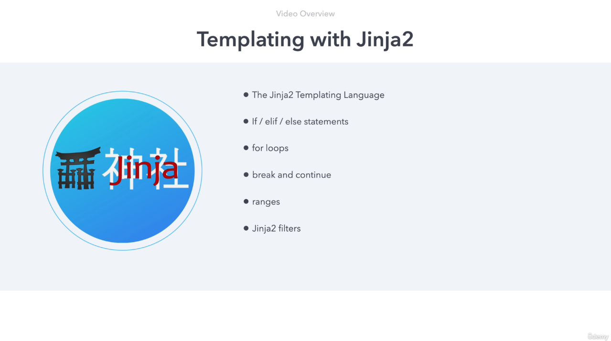

### Templating with Jinja2 in Ansible

#### Introduction to Jinja2 Templating
Hello and welcome to this video on **Templating with Jinja2**.

Ansible makes extensive use of the Jinja2 templating language. Jinja2 is a powerful and versatile templating engine that allows dynamic generation of content, commonly configuration files, scripts, and templates. While we’ve previously used double curly brackets `{{ }}` to access variables in Ansible playbooks, Jinja2’s capabilities extend far beyond that.

Jinja2 is a rich subject, with numerous books and resources dedicated to it. Mastering Jinja2 not only enhances your skills in templating but also greatly improves your efficiency with Ansible. 

---

#### Common Use Cases for Jinja2 in Ansible
In Ansible, Jinja2 templating is predominantly used in two ways:
1. **Within Playbooks**: Embedding logic directly in playbook tasks for dynamic operations.
2. **As a Templating Agent**: Generating files like configuration files dynamically based on variables and conditions.

---

#### Overview of Jinja2 Features Covered
This video will explore key Jinja2 features, including:
- Conditional Statements (`if`, `elif`, `else`)
- Loops (`for`)
- Break and Continue
- Ranges
- Filters

We’ll also see how Jinja2 integrates with Ansible through examples. Let’s dive in.

---

### Conditional Statements in Jinja2
#### Revision 01: Using `if` Statement
In our first example, we use an `if` statement to check if the host is `ubuntu-c`. Here’s the playbook snippet:

```yaml
- debug:
    msg: "{{ 'ubuntu-c' if ansible_hostname == 'ubuntu-c' }}"
```

Key details:
- The minus symbol (`-`) at the end of the `if` statement ensures no blank lines are generated from the template structure.
- Running this against all hosts shows only one host (`ubuntu-c`) satisfying the condition.

---

#### Revision 02: Adding `elif` for Multiple Conditions
We modify the playbook to include `elif` for additional conditions:

```yaml
- debug:
    msg: >
      
        ubuntu-c
      
        centos1
      
```

This logic handles multiple hosts like `ubuntu-c` and `centos1`.

---

#### Revision 03: Adding `else` to Cover All Cases
To handle all scenarios, we add an `else` block:

```yaml
- debug:
    msg: >
      
        ubuntu-c
      
        centos1
      
        Other host: {{ ansible_hostname }}
      
```

The `else` clause provides a default behavior, ensuring the task works across all hosts.

---

#### Revision 04: Checking Variable Definition
You can check if a variable is defined using `is defined`. Example:

```yaml
- debug:
    msg: >
      
        Variable is defined
      
        Variable is not defined
      
```

If `my_variable` is undefined, the `else` block triggers. After defining the variable, the playbook detects it correctly.

---

### Loops in Jinja2
#### Revision 05: Iterating Through Lists
Here’s an example of looping through network interfaces:

```yaml
- debug:
    msg: >
      
        Interface {{ loop.index }}: {{ interface }}
      
```

Details:
- `loop.index`: Provides the iteration count.
- `ansible_interfaces`: An example list containing network interfaces.

---

#### Revision 06: Using Ranges
Generating numbers from 1 to 10:

```yaml
- debug:
    msg: >
      
        {{ num }}
      
```

Explanation:
- The range’s second parameter (`11`) is exclusive, so the output is from 1 to 10.

---

#### Revision 07: Break and Continue
Jinja2 doesn’t natively support `break` and `continue` in Ansible, but you can enable these via extensions:

**Example**:
```yaml
- debug:
    msg: >
      
        
          
        
        {{ num }}
      
```

---

#### Revision 08: Skipping Odd Numbers with `continue`
Skip odd numbers in a range:

```yaml
- debug:
    msg: >
      
        {% if num % 2 != 0 %}
          
        
        {{ num }}
      
```

Output: Only even numbers appear.

---

### Filters in Jinja2
#### Revision 09: Useful Filters
Jinja2 filters allow data transformation. Examples:

1. **Min and Max**:
   ```yaml
   - debug:
       msg: "Min: {{ [1, 2, 3, 4, 5] | min }} Max: {{ [1, 2, 3, 4, 5] | max }}"
   ```

2. **Unique**:
   ```yaml
   - debug:
       msg: "{{ [1, 1, 2, 2, 3] | unique }}"
   ```

3. **Difference Between Lists**:
   ```yaml
   - debug:
       msg: "{{ [1, 2, 3, 4, 5] | difference([2, 3]) }}"
   ```

4. **Random Selection**:
   ```yaml
   - debug:
       msg: "{{ ['rod', 'jane', 'freddy'] | random }}"
   ```

5. **URL Split**:
   ```yaml
   - debug:
       msg: "{{ 'https://docs.ansible.com' | urlsplit('hostname') }}"
   ```

---

### Ansible Template Module
#### Practical Usage
The Ansible `template` module applies Jinja2 to generate files dynamically.

**Example**:
```yaml
- name: Generate Nginx config
  template:
    src: nginx.j2
    dest: /etc/nginx/nginx.conf
```

Template file `nginx.j2`:
```jinja2
server {
    listen 80;
    server_name {{ ansible_hostname }};
    location / {
        root /var/www/html;
        index index.html;
    }
}
```

Rendered output:
```nginx
server {
    listen 80;
    server_name ubuntu-c;
    location / {
        root /var/www/html;
        index index.html;
    }
}
```

---

### Summary
In this video, we explored:
- Jinja2 conditionals, loops, ranges, and filters.
- Extending Jinja2 with `break` and `continue`.
- Using the `template` module to dynamically create configuration files.

---

### Next Steps
In the next video, we’ll apply Jinja2 knowledge to deploy an **Nginx server using Ansible playbooks**. Stay tuned!